# Pixel-Refit

Use and Install here : https://pixel-refit.netlify.app/

- A **Photo Editor** with cool features.
- A **Responsive Progressive Web App (PWA)**
- **Installable and can be used in mobile natively**
- Features : **grayscale, brightness, blur, saturation, hue rotate, export, etc.**

## Loading Window (Desktop):

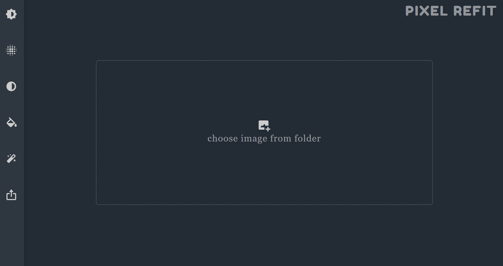

## Sample Image :

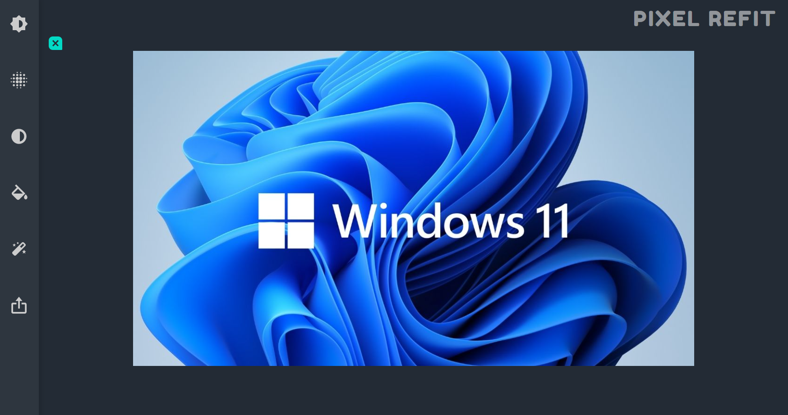

## Brightness Feature :
- Adjust color illumination of your image with Brightness feature.

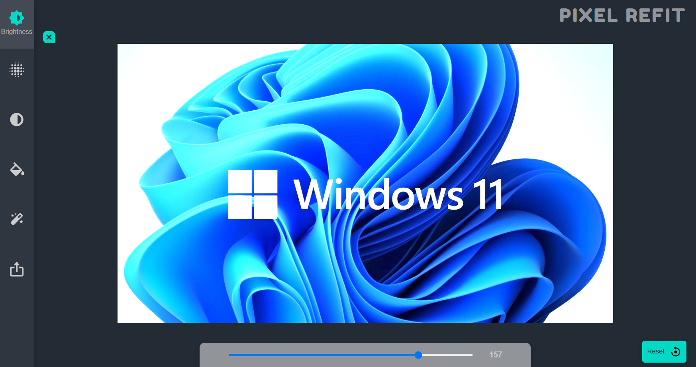

## Blur Feature :
- Alter softenness of your image with Blur feature.

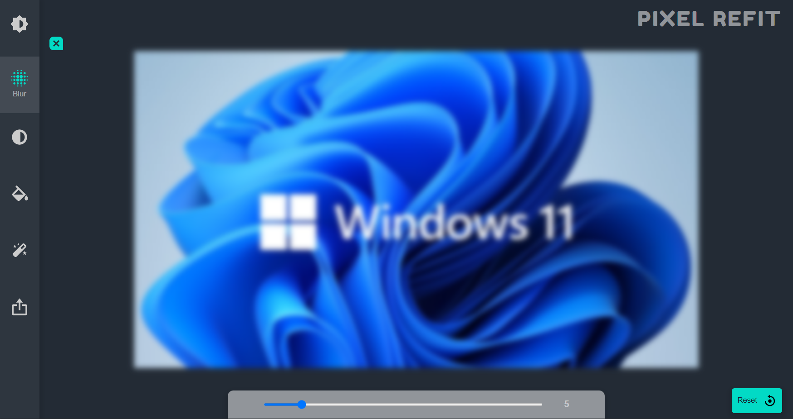

## GrayScale Feature :
- Provide a grey shade to your image with GrayScale feature.

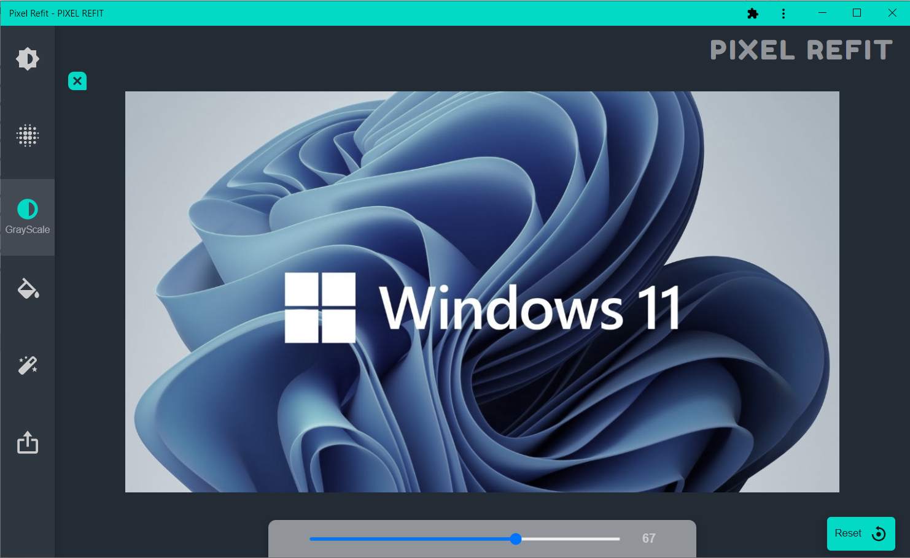

## Hue-Rotate Feature :
- Enhance color tone of your image with Hue Rotate feature

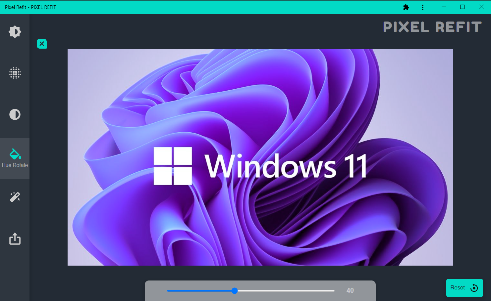

## Saturation Feature :
- Modify color temperature of your image with Saturation feature

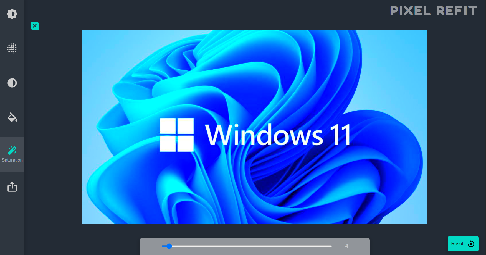

## Export to your Device :
- Save your editted image in your local directory with Export feature

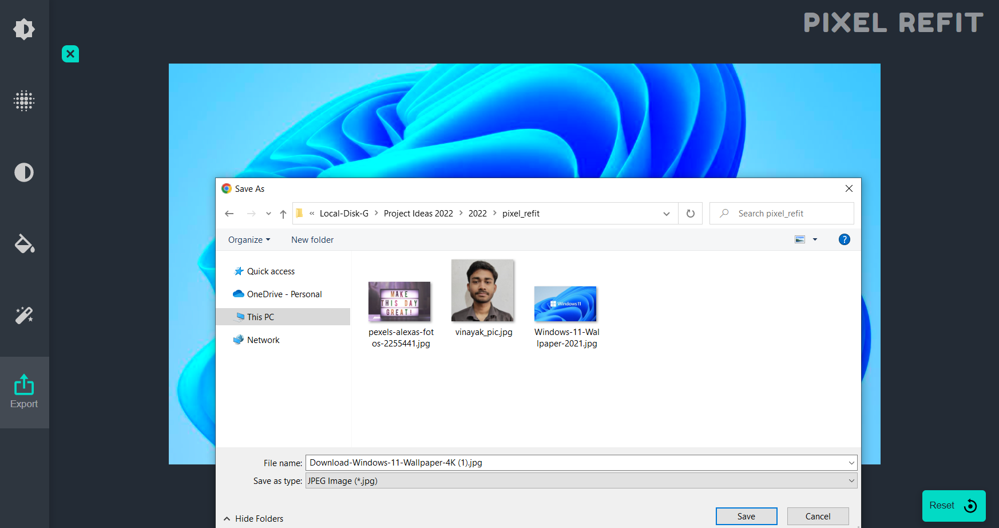

## Loading Window (Mobile):

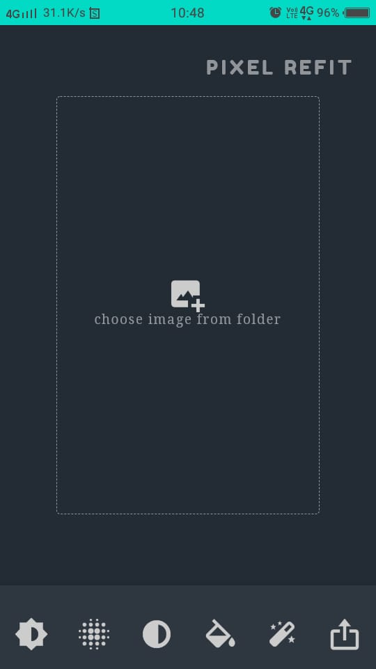

## Sample Image (Mobile):

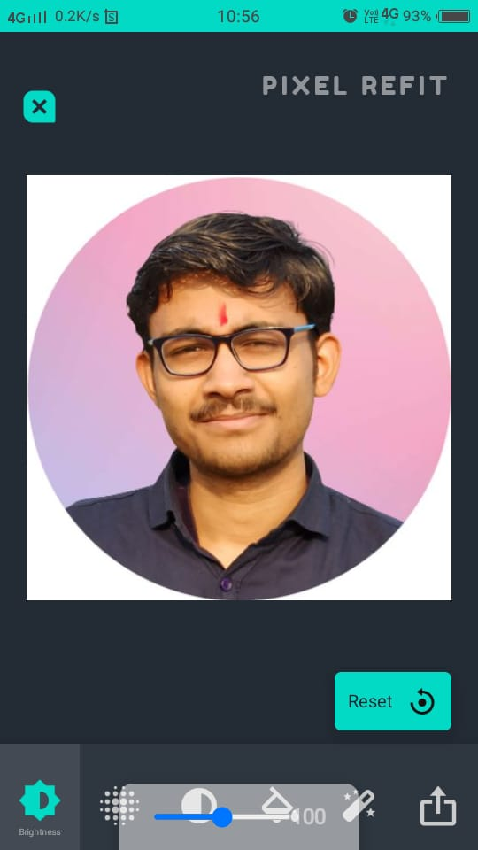

## Installable (Mobile):

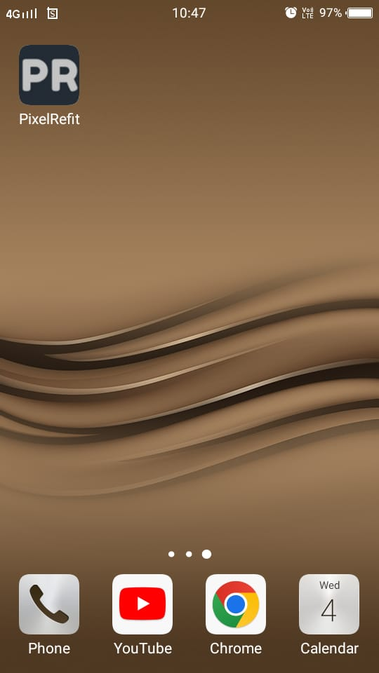
