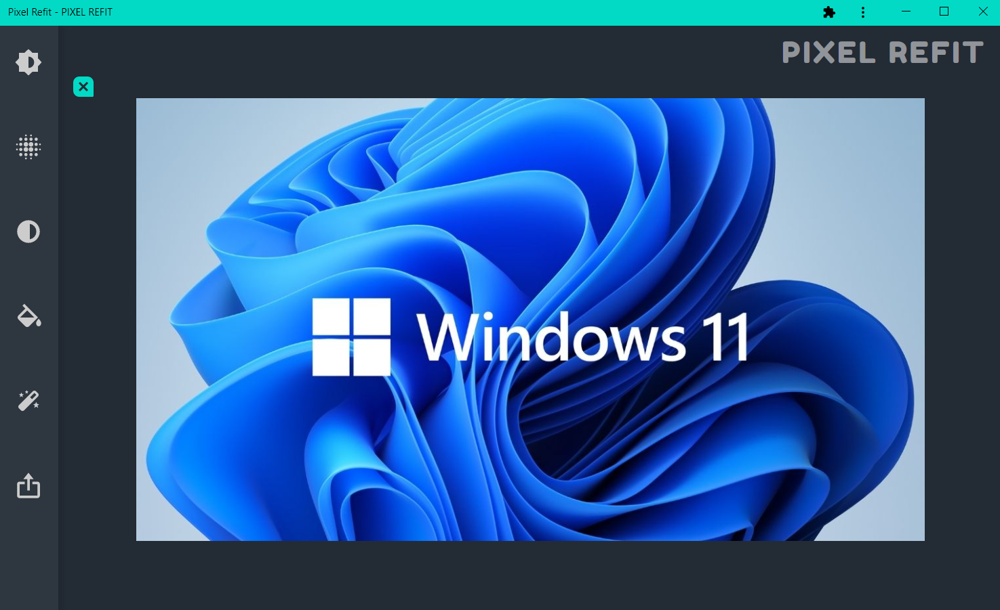
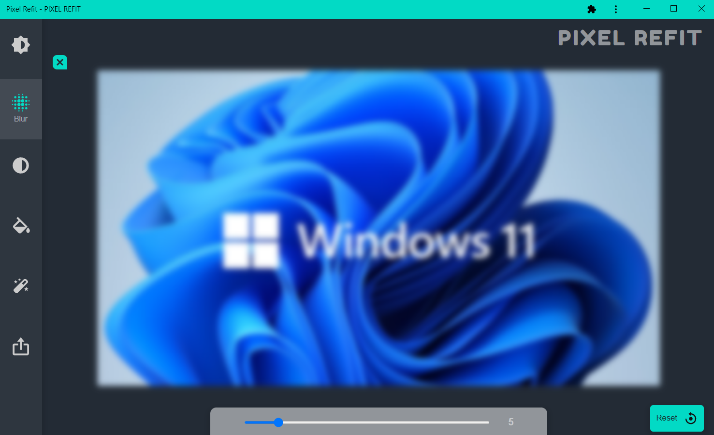

# Pixel-Refit

Use and Install here : https://pixel-refit.netlify.app/

- A **Photo Editor** with cool features.
- A **Responsive Progressive Web App (PWA)**
- **Installable and can be used in mobile natively**
- Features : **grayscale, brightness, blur, saturation, hue rotate, export, etc.**

## Loading Window (Desktop):

## Sample Image :

## Brightness Feature :

## Blur Feature :

## GrayScale Feature :

## Hue-Rotate Feature :

## Saturation Feature :

## Export to your Device :

## Loading Window (Mobile):

## Sample Image (Mobile):

## Installable (Mobile):

