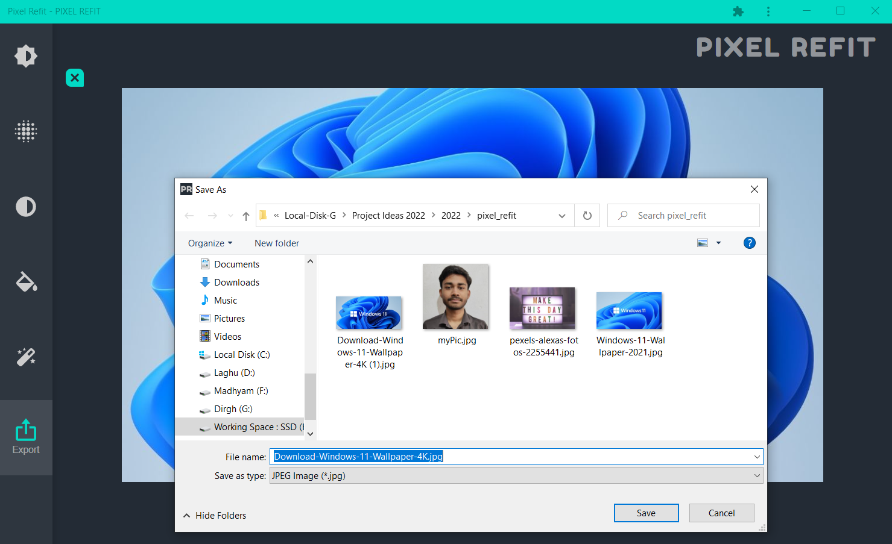

# Pixel-Refit

Use and Install here : https://pixel-refit.netlify.app/

- A Photo Editor with cool features.
- A Responsive Progressive Web App (PWA)
- Installable and can be used in mobile natively
- Features : grayscale, brightness, blur, saturation, hue rotate, export, etc.

## Loading Window :

## Examplanary Image :

## Brightness Feature :

## Blur Feature :

## GrayScale Feature :

## Hue-Rotate Feature :

## Saturation Feature :

## Export to your Device :

